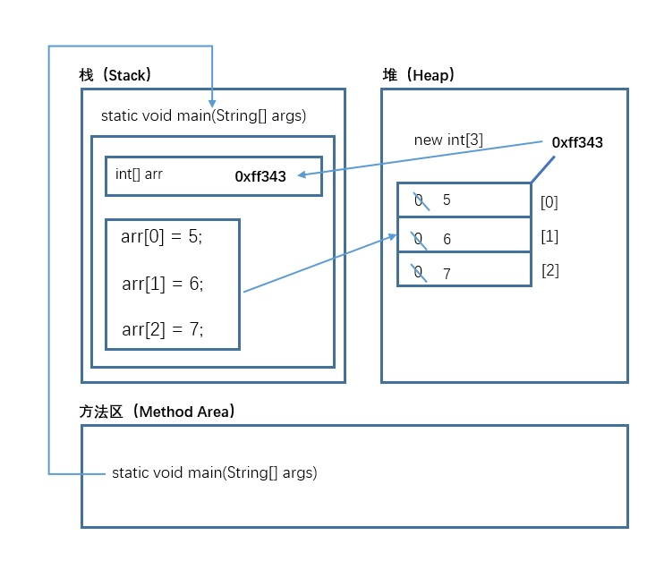

[toc]

## 1 二进制

字节是计算机中最小存储单元。计算机存储任何的数据，都是以字节的形式存储。8个bit（二进制位） 0000-0000表示为1个字节，写成1 byte或者1 B。

- 8 bit = 1 B
- 1024 B =1 KB
- 1024 KB =1 MB
- 1024 MB =1 GB
- 1024 GB = 1 TB


## 2 Java虚拟机


虚拟机是一种抽象化的计算机，通过在实际的计算机上仿真模拟各种计算机功能来实现的。Java虚拟机（Java Virtual Machine，JVM ）有自己完善的硬体架构，如处理器、堆栈、寄存器等，还具有相应的指令系统。Java虚拟机屏蔽了与具体操作系统平台相关的信息，使得Java程序只需生成在Java虚拟机上运行的目标代码(字节码)，就可以在多种平台上不加修改地运行。

所谓的java虚拟机，就是一台虚拟的机器。它是一款软件，用来执行一系列虚拟计算机指令，大体上虚拟机可以分为系统虚拟机和程序虚拟机。visual Box、VMWare就属于系统虚拟机。他们完全是对物理计算机的仿真，提供一个可运行完整操作系统的软件平台。而java虚拟机就是典型程序虚拟机，它专门为执行单个计算机程序而设计，在java虚拟机中执行的指令我们称之为java字节码指令。java发展到今天，出现了很多虚拟机，最初sun使用的叫Classic的java虚拟机，到现在使用最广泛的是HotSpot虚拟机，除了sun以外还有BEA的JRockit,目前JRockit和HotSpot都被甲骨文公司收入旗下，大有整合的趋势。

任何软件的运行，都必须要运行在操作系统之上，而我们用Java编写的软件可以运行在任何的操作系
统上，这个特性称为Java语言的**跨平台特性**。该特性是由JVM实现的，我们编写的程序运行在JVM上，而JVM运行在操作系统上。


## 2 JRE  和 JDK

- JRE  (Java Runtime Environment) ：是Java程序的运行时环境，包含 JVM 和运行时所需要的 核心类库 。
-  JDK (Java Development Kit)：是Java程序开发工具包，包含 JRE 和开发人员使用的工具。


我们想要运行一个已有的Java程序，那么只需安装 JRE 即可。我们想要开发一个全新的Java程序，那么必须安装 JDK 。


## 3 常量和变量

- 常量：程序运行中固定不变的量
- 变量：程序中运行可以变化的量


常量分类：

| 类型       | 含义                                   | 举例                        |
| ---------- | -------------------------------------- | --------------------------- |
| 整数常量   | 所有的整数                             | 0，1， 567， -9             |
| 小数常量   | 所有的小数                             | 0.0， -0.1， 2.55           |
| 字符常量   | 单引号引起来,只能写一个字符,必须有内容 | 'a' ， ' '， '好'           |
| 字符串常量 | 双引号引起来,可以写多个字符,也可以不写 | "A" ，"Hello" ，"你好" ，"" |
| 布尔常量   | 只有两个值                             | true ， false               |
| 空常量     | 只有一个值                             | null                        |


变量分类：

Java的数据类型分为两大类：

- 基本数据类型 ：整数 、 浮点数 、 字符 、 布尔 。
- 引用数据类型 ：类 、 数组 、 接口 。


| 数据类型     | 关键字         | 占用内存 | 取值范围              |
| ------------ | -------------- | -------- | --------------------- |
| 字节型       | byte           | 1个字节  | -128~127              |
| 短整型       | short          | 2个字节  | -32768~32767          |
| 整型         | int（默认）    | 4个字节  | $-2^{31}$~$2^{31}-1$  |
| 长整型       | long           | 8个字节  | $-2^{63}$~$2^{63}-1$  |
| 单精度浮点数 | float          | 4个字节  | 1.4013E-45~3.4028E+38 |
| 双精度浮点数 | double（默认） | 8个字节  | 4.9E-324~1.7977E+308  |
| 字符型       | char           | 2个字节  | 0-65535               |
| 布尔类型     | boolean        | 1个字节  | true，false           |

> long类型：建议数据后加L表示
> float类型：建议数据后加F表示


## 4 数据类型转换


### 4.1 自动类型转换（隐式）

- 特点：代码不需要进行特殊处理，自动完成。
- 规则：数据范围从小到大。

### 4.2 强制类型转换（显式）

- 特点：代码需要进行特殊的格式处理，不能自动完成。

- 格式：范围小的类型 范围小的变量名 = (范围小的类型) 原本范围大的数据;


注意事项：

1. 强制类型转换一般不推荐使用，因为有可能发生精度损失、数据溢出。

2. byte/short/char这三种类型都可以发生数学运算，例如加法“+”.
3. byte/short/char这三种类型在运算的时候，都会被首先**提升成为int类型**，然后再计算。
4. boolean类型不能发生数据类型转换


## 5 运算符

### 5.1 算数运算符

| 符号     | 说明                         |
| -------- | ---------------------------- |
| +        | 加法运算，字符串连接运算     |
| -        | 减法运算                     |
| *        | 乘法运算                     |
| /        | 除法运算                     |
| %        | 取模运算，两个数字相除取余数 |
| ++ 、 -- | 自增自减运算                 |

**前++和后++的区别**

```java
public static void main(String[] args) {
    int a = 1;
    int b = ++a;
    System.out.println(a);//计算结果是2
    System.out.println(b);//计算结果是2
}
```

```java
public static void main(String[] args) {
    int a = 1;
    int b = a++;
    System.out.println(a);//计算结果是2
    System.out.println(b);//计算结果是1
}
```

### 5.2  赋值运算符

### 

| 符号 | 说明   |
| ---- | ------ |
| =    | 等于号 |
| +=   | 加等于 |
| - =  | 减等于 |
| *=   | 乘等于 |
| /=   | 除等于 |
| %=   | 取模等 |


### 5.3 比较运算符

| 符号 | 说明                                                         |
| ---- | ------------------------------------------------------------ |
| ==   | 比较符号两边数据是否相等，相等结果是true。                   |
| <    | 比较符号左边的数据是否小于右边的数据，如果小于结果是true。   |
| >    | 比较符号左边的数据是否大于右边的数据，如果大于结果是true。   |
| <=   | 比较符号左边的数据是否小于或者等于右边的数据，如果小于结果是true。 |
| >=   | 比较符号左边的数据是否大于或者等于右边的数据，如果小于结果是true。 |
| ！ = | 不等于符号 ，如果符号两边的数据不相等，结果是true。          |


### 5.4  逻辑运算符

| 符号       | 说明                                                         |
| ---------- | ------------------------------------------------------------ |
| && 短路与  | 1. 两边都是true，结果是true<br/>2. 一边是false，结果是false<br/>**短路特点：符号左边是false，右边不再运算** |
| \|\|短路或 | 1. 两边都是false，结果是false<br/>2. 一边是true，结果是true<br/>**短路特点： 符号左边是true，右边不再运算** |
| ！ 取反    | 1. ! true 结果是false<br/>2. ! false结果是true               |

### 5.5  三元运算符

三元运算符格式：

` 数据类型 变量名 = 布尔类型表达式？结果1：结果2`

示例：

```java
public static void main(String[] args) {
    int i = (1==2 ? 100 : 200);
    System.out.println(i);//200
    int j = (3<=4 ? 500 : 600);
    System.out.println(j);//500
}
```


## 6 方法

> **方法**： 就是将一个功能抽取出来，把代码单独定义在一个大括号内，形成一个单独的功能。当我们需要这个功能的时候，就可以去调用。这样即实现了代码的复用性，也解决了代码冗余的现象。


定义格式：

```java
修饰符 返回值类型 方法名 （参数列表）｛
     代码...        
    return ;     
｝
```


示例：

```java
public static void methodName() {
   System.out.println("这是一个方法");  
}
```


## 7  JShell脚本工具

JShell脚本工具是JDK9的新特性,当我们编写的代码非常少的时候，而又不愿意编写类，main方法，也不愿意去编译和运
行，这个时候可以使用JShell工具。

启动JShell工具，在DOS命令行直接输入JShell命令。


## 8 判断语句if-else

语句格式：

```java
if (判断条件1) {
   执行语句1;  
} else if (判断条件2) {
   执行语句2;  
}
...
}else if (判断条件n) {
  执行语句n;   
} else {
   执行语句n+1;  
}
```


## 9 选择语句swich-case

语句格式：

```java
switch(表达式) {
  case 常量值1:
    语句体1;
    break;
  case 常量值2:
    语句体2;
    break;
  ...
  default:
    语句体n+1;
    break;
}
```


## 10 循环语句

### 10.1 循环语句for

语句格式：

```java
for(初始化表达式①; 布尔表达式②; 步进表达式④){
循环体③        
}
```

执行流程
执行顺序：①②③④ >②③④>②③④…②不满足为止。
①负责完成循环变量初始化
②负责判断是否满足循环条件，不满足则跳出循环
③具体执行的语句
④循环后，循环条件所涉及变量的变化情况

 

### 10.2 循环语句while

语句格式1:

```java
初始化表达式①
  while(布尔表达式②){
    循环体③
    步进表达式④
}
```

执行流程
执行顺序：①②③④ >②③④>②③④…②不满足为止。
①负责完成循环变量初始化。
②负责判断是否满足循环条件，不满足则跳出循环。
③具体执行的语句。
④循环后，循环变量的变化情况。


语句格式2：

```java
初始化表达式①
    do{
    循环体③
    步进表达式④
}while(布尔表达式②);
```

执行流程
执行顺序：①③④ >②③④>②③④…②不满足为止。
①负责完成循环变量初始化。
②负责判断是否满足循环条件，不满足则跳出循环。
③具体执行的语句
④循环后，循环变量的变化情况


### 10.3 break和continue

#### break

使用场景：终止 switch或者循环

- 在选择结构 switch语句中
- 在循环语句中
- 离开使用场景的存在是没有意义的

示例：

```java
public static void main(String[] args) {
    for (int i = 1; i<=10; i++) {
        //需求:打印完两次HelloWorld之后结束循环
        if(i == 3){
          break;
        }
        System.out.println("HelloWorld"+i);
    }
}
```

### 

#### continue

使用场景：结束本次循环，继续下一次的循环

示例：

```java
public static void main(String[] args) {
    for (int i = 1; i <= 10; i++) {
        //需求:不打印第三次HelloWorld
        if(i == 3){
          continue;
        }
        System.out.println("HelloWorld"+i);
    }
}
```


## 11 IDEA快捷键


| 快捷键              | 功能                                   |
| ------------------- | -------------------------------------- |
| Alt + Enter         | 导入包，自动代码修正                   |
| Ctrl+Y              | 删除光标所在行                         |
| Ctrl+D              | 复制光标所在行的内容，插入光标位置下面 |
| Ctrl+Alt+L          | 格式化代码                             |
| Ctrl+/              | 单行注释                               |
| Ctrl+Shift+/        | 选中代码注释，多行注释，再按取消注释   |
| Alt+Ins             | 自动生成代码，toString，get，set等方法 |
| Alt+Shift+ 上下箭头 | 移动当前代码行                         |
| Shift+F6            | 同时修改不同地方的同一个量             |
| 输入sout            | System.out.println();                  |
| 输入psvm            | public static void main(String[] args) |
| 输入5.fori          | for (int i = 0; i < 5; i++)            |
|                     |                                        |


## 12 数组

### 12.1 容器

容器： 是将多个数据存储到一起，每个数据称为该容器的元素。


### 12.2 数组概念

数组概念： 数组就是存储数据长度固定的容器，保证多个数据的数据类型要一致。


### 12.3 数组的定义

#### 方式一

格式：

```java
数组存储的数据类型[] 数组名字 = new 数组存储的数据类型[长度];
```

示例：

```java
int[] arr = new int[3];
```


#### 方式二

格式：

```java
数据类型[] 数组名 = new 数据类型[]{元素1,元素2,元素3...};
```

示例：

```java
int[] arr = new int[]{1,2,3,4,5};
```


#### 方式三

格式：

```java
数据类型[] 数组名 = {元素1,元素2,元素3...};
```

示例：

```java
int[] arr = {1,2,3,4,5};
```


【注意】：

1. 数组有定长特性，长度一旦指定，不可更改
2. `方式三`同样也进行了`new`操作


### 12.4 数组操作

- 索引： 每一个存储到数组的元素，都会自动的拥有一个编号，从0开始，这个自动编号称为数组索引(index)，可以通过数组的索引访问到数组中的元素。
- 数组的长度： 每个数组都具有长度，而且是固定的，Java中赋予了数组的一个属性，可以获取到数组的长度，语句为： `数组名 .length` ，属性length的执行结果是数组的长度，int类型结果。由次可以推断出，数组的最大索引值为` 数组名 .length-1 `。
- 索引访问数组中的元素: `数组名[索引]`

示例：

```java
public static void main(String[] args) {
    //定义存储int类型数组，赋值元素1，2，3，4，5
    int[] arr = {1,2,3,4,5};
    //为0索引元素赋值为6
    arr[0] = 6;
    //获取数组0索引上的元素
    int i = arr[0];
    System.out.println(i);
    //直接输出数组0索引元素
    System.out.println(arr[0]);
}
```

#### 数组取最大值

代码如下：

```java
public static void main(String[] args) {
    int[] arr = { 5, 15, 2000, 10000, 100, 4000 };
    //定义变量，保存数组中0索引的元素
    int max = arr[0];
    //遍历数组，取出每个元素
    for (int i = 0; i < arr.length; i++) {
      //遍历到的元素和变量max比较
      //如果数组元素大于max
      if (arr[i] > max) {
        //max记录住大值
        max = arr[i];
      }
    }
    System.out.println("数组最大值是： " + max);
}
```


#### 数组反转

代码如下：


```java
public static void main(String[] args) {
    int[] arr = { 1, 2, 3, 4, 5 };
    /*
      循环中定义变量min=0最小索引
      max=arr.length‐1最大索引
      min++,max‐‐
      */
    for (int min = 0, max = arr.length ‐ 1; min <= max; min++, max‐‐) {
      //利用第三方变量完成数组中的元素交换
      int temp = arr[min];
      arr[min] = arr[max];
      arr[max] = temp;
    }
    // 反转后，遍历数组
    for (int i = 0; i < arr.length; i++) {
      System.out.println(arr[i]);
    }
}
```


### 12.5 数组内存划分


内存是计算机中的重要原件，临时存储区域，作用是运行程序。我们编写的程序是存放在硬盘中的，在硬盘中的程序是不会运行的，必须放进内存中才能运行，运行完毕后会清空内存。

Java虚拟机要运行程序，必须要对内存进行空间的分配和管理。

**Java的内存需要划分成为5个部分:**

1. 栈(Stack) :存放的都是方法中的局部变量。**方法的运行一定要在栈当中运行。**
   - 局部变量:方法的参数，或者是方法{}内部的变量
   - 作用域:一旦超出作用域，立刻从栈内存当中消失。

2. 堆(Heap) :凡是new出来的东西，都在堆当中。
   - 堆内存里面的东西都有一一个地址值: 16进制
   - 堆内存里面的数据，都有默认值。规则:
     - 如果是整数  默认为0
     - 如果是浮点数  默认为0.0
     - 如果是字符 默认为'\u0000'
     - 如果是布尔  默认为false
     - 如果是引用类型  默认为null
3. 方法区(Method Area) :存储class相关信息，包含方法的信息。

4. 本地方法栈(Native Method Stack) :与操作系统相关。

5. 寄存器(pc Register) :与CPU相关。


示例：

```java
public static void main(String[] args) {
    
    // 定义数组，存储3个元素
    int[] arr = new int[3];
    
    //数组索引进行赋值
    arr[0] = 5;
    arr[1] = 6;
    arr[2] = 7;
    
    //输出3个索引上的元素值
    System.out.println(arr[0]);
    System.out.println(arr[1]);
    System.out.println(arr[2]);

}
```

代码执行流程：

1. main方法进入方法栈。程序运行前main方法存储在方法区，程序运行时，main方法进入栈
2. 创建数组。JVM在堆内存中开辟一个内存空间存储数组（new int[3])，数组中的三个元素默认值为0。内存地址以一个十六进制数表示（0xff343）。
3. JVM将内存地址赋值给变量 arr。**变量arr保存的是数组内存中的地址，而不是一个具体的数值，因此数组为引用数据类型。**
4. 根据数组索引给数组的3个元素赋值，分布赋值为5，6，7。然后进行打印。




两个变量指向同一个数据：

```java
public static void main(String[] args) {
    // 定义数组，存储3个元素
    int[] arr = new int[3];
    //数组索引进行赋值
    arr[0] = 5;
    arr[1] = 6;
    arr[2] = 7;
    //输出3个索引上的元素值
    System.out.println(arr[0]);
    System.out.println(arr[1]);
    System.out.println(arr[2]);
    //定义数组变量arr2，将arr的地址赋值给arr2
    int[] arr2 = arr;
    arr2[1] = 9;
    System.out.println(arr[1]);
}
```


上述代码中，arr和arr2都指向同一个内存地址，`arr2[1] = 9`执行后，`arr[1]`也会跟着改变。


## 13   面向对象

Java语言是一种面向对象的程序设计语言，而面向对象思想是一种程序设计思想，我们在面向对象思想的指引下，
使用Java语言去设计、开发计算机程序。 这里的对象泛指现实中一切事物，每种事物都具备自己的属性和行为。面向对象思想就是在计算机程序设计过程中，参照现实中事物，将事物的属性特征、行为特征抽象出来，描述成计算机事件的设计思想。 它区别于面向过程思想，强调的是通过调用对象的行为来实现功能，而不是自己一步一步的去操作实现。 


面向对象思想是一种更符合我们思考习惯的思想，它可以将复杂的事情简单化，并将我们从执行者变成了指挥者。**面向对象的语言中，包含了三大基本特征，即封装、继承和多态。**

### 13.1 类和对象

-  类 ：是一组相关**属性**和**行为**的集合。可以看成是一类事物的模板，使用事物的属性特征和行为特征来描述该
  类事物。
  - 属性：事物的状态信息。 
  - 行为：事物能够做什么。
-  对象 ：是一类事物的具体体现。对象是类的一个实例，必然具备该类事物的属性和行为。
-  类与对象的关系
  - 类是对一类事物的描述，是 抽象的。
  - 对象是一类事物的实例，是 具体的。
  - 类是对象的模板，对象是类的实体 。


### 13.2 类的定义

定义格式：

```java
public class ClassName {
  //成员变量
  //成员方法
}
```


示例：

```java
public class Student {
   //成员变量  
   String name；//姓名  
   int age；//年龄
   
   //成员方法
   //学习的方法
    public void study() {
    System.out.println("好好学习，天天向上");
  }
  //吃饭的方法
  publicvoid eat() {
    System.out.println("学习饿了要吃饭");
  }
}    
```


### 13.2 对象使用


#### 对象的使用格式

创建对象：

```java
类名 对象名 = new 类名();
```


使用对象访问类中的成员:

```java
对象名.成员变量；
对象名.成员方法()；
```


示例：

```java
public class Test01_Student {
  public static void main(String[] args) {
    //创建对象格式：类名 对象名 = new 类名();
    Student s = new Student();
    System.out.println("s:"+s); //cn.itcast.Student@100363
    //直接输出成员变量值
    System.out.println("姓名："+s.name); //null
    System.out.println("年龄："+s.age); //0
    System.out.println("‐‐‐‐‐‐‐‐‐‐");
    //给成员变量赋值
    s.name = "赵丽颖";
    s.age = 18;
    //再次输出成员变量的值
    System.out.println("姓名："+s.name); //赵丽颖
    System.out.println("年龄："+s.age); //18
    System.out.println("‐‐‐‐‐‐‐‐‐‐");
    //调用成员方法
    s.study(); // "好好学习，天天向上"
    s.eat(); // "学习饿了要吃饭"
  }
}
```


#### 成员变量的默认值

- 基本类型：
  - 整数（byte，short，int，long）：0
  - 浮点数（float，double）：0.0
  - 字符（char）： '\u0000'
  - 布尔（boolean）：false

	- 引用类型：数组，类，接口 null


### 13.3 成员变量和局部变量区别

```java
public class Car{
    String color; //成员变量
    public void drive(){
        int speed = 80; //局部变量
        //......
    }
}
```


- 在类中的位置不同
  - 成员变量：类中，方法外
  -  局部变量：方法中或者方法声明上 (形式参数)
- 作用范围不一样
  - 成员变量：类中
  - 局部变量：方法中
- 初始化值的不同
  - 成员变量：有默认值
  - 局部变量：没有默认值。必须先定义，赋值，最后使用在内
- 存中的位置不同 
  - 成员变量：堆内存
  - 局部变量：栈内存
- 生命周期不同
  - 成员变量：随着对象的创建而存在，随着对象的消失而消失
  - 局部变量：随着方法的调用而存在，随着方法的调用完毕而消失           


### 13.4 封装

面向对象编程语言是对客观世界的模拟，客观世界里成员变量都是隐藏在对象内部的，外界无法直接操作和修改。封装可以被认为是一个保护屏障，防止该类的代码和数据被其他类随意访问。要访问该类的数据，必须通过指定的方式。适当的封装可以让代码更容易理解与维护，也加强了代码的安全性。

封装的步骤
1. 使用  private 关键字来修饰成员变量。
2. 对需要访问的成员变量，提供对应的一对  getXxx 方法 、 setXxx 方法。

#### private关键字

private的含义
1. private是一个权限修饰符，代表最小权限。
2. 可以修饰成员变量和成员方法。
3. 被private修饰后的成员变量和成员方法，只在本类中才能访问。

private的使用格式：

```java
private 数据类型 变量名 ；
```


1. 使用  private 修饰成员变量，代码如下：

```java
public class Student {
  private String name;
  private int age;
}
```


2. 提供  getXxx 方法 /  setXxx 方法，可以访问成员变量，代码如下：

```java
public class Student {
  private String name;
  private int age;
  public void setName(String n) {
    name = n;
  }
  public String getName() {
    return name;
  }
  public void setAge(int a) {
    age = a;
  }
  public int getAge() {
    return age;
  }
}
```


#### this关键字

this的含义this代表所在类的当前对象的引用（地址值），即对象自己的引用。

**方法被哪个对象调用，方法中的this就代表那个对象。即谁在调用，this就代表谁。**

this使用格式:

```java
this.成员变量名；
```


使用  this 修饰方法中的变量，解决成员变量被隐藏的问题，代码如下：

> 由于形参变量名与成员变量名重名，导致成员变量名被隐藏，方法中的变量名，无法访问到成员变量，从而赋值失败。所以，我们只能使用this关键字，来解决这个重名问题。

```java
public class Student {
  private String name;
  private int age;
  public void setName(String name) {
    //name = name;
    this.name = name;
  }
  public String getName() {
    return name;
  }
  public void setAge(int age) {
    //age = age;
    this.age = age;
  }
  public int getAge() {
    return age;
  }
```


#### 构造方法

当一个对象被创建时候，构造方法用来初始化该对象，给对象的成员变量赋初始值。

**无论你与否自定义构造方法，所有的类都有构造方法，因为Java自动提供了一个无参数构造方法，一旦自己定义了构造方法，Java自动提供的默认无参数构造方法就会失效。**

构造方法的定义格式:


```java
修饰符 构造方法名(参数列表){
// 方法体    
}
```


构造方法的写法上，方法名与它所在的类名相同。它没有返回值，所以不需要返回值类型，甚至不需要void。使用构造方法后，代码如下：

```java
public class Student {
  private String name;
  private int age;
  // 无参数构造方法
  public Student() {}
  // 有参数构造方法
  public Student(String name,int age) {
    this.name = name;
    this.age = age;
  }
}
```


注意事项
1. 如果你不提供构造方法，系统会给出无参数构造方法。
2. 如果你提供了构造方法，系统将不再提供无参数构造方法。
3. 构造方法是可以重载的，既可以定义参数，也可以不定义参数。


#### JavaBean

JavaBean 是 Java语言编写类的一种标准规范。符合 JavaBean 的类，要求类必须是具体的和公共的，并且具有无参数的构造方法，提供用来操作成员变量的 set 和 get 方法。  

```java
public class ClassName{
  //成员变量
  //构造方法
  //无参构造方法【必须】
  //有参构造方法【建议】
  //成员方法   
  //getXxx()
  //setXxx()
}
```


编写符合 JavaBean 规范的类，以学生类为例，标准代码如下：

```java
public class Student {
  //成员变量
  private String name;
  private int age;
  //构造方法
  public Student() {}
  public Student(String name,int age) {
    this.name = name;
    this.age = age;
  }
  //成员方法
  publicvoid setName(String name) {
    this.name = name;
  }
  public String getName() {
    return name;
  }
  publicvoid setAge(int age) {
    this.age = age;
  }
  publicint getAge() {
    return age;
  }
}
```


## 14  static关键字

关于  static 关键字的使用，它可以用来修饰的**成员变量**和**成员方法**，被修饰的成员是属于类的，而不是单单是属
于某个对象的。也就是说，既然属于类，就可以不靠创建对象来调用了。


### 14.1 类变量

当  static 修饰**成员变量**时，该变量称为**类变量**。该类的每个对象都共享同一个类变量的值。任何对象都可以更改该类变量的值，但也可以在不创建该类的对象的情况下对类变量进行操作。

格式：

```java
static 数据类型 变量名；
```


示例：

创建Student类

```java
public class Student {
    private int id;
    private String name;
    private int age;
    static String room;
    private static int idCounter = 0; //学号计数器，每当new了一个新对象的时候，计数器++

    public Student(){
        this.id = ++idCounter;
    }

    public Student(String name,int age) {
        this.id = ++idCounter;
        this.name = name;
        this.age = age;
    }

    public int getId() {
        return id;
    }

    public void setId(int id) {
        this.id = id;
    }

    public String getName() {
        return name;
    }

    public void setName(String name) {
        this.name = name;
    }

    public int getAge() {
        return age;
    }

    public void setAge(int age) {
        this.age = age;
    }
}

```


调用：

```java
public class StaticDemo {
    public static void main(String[] args) {

        // 首先设置一下教室，这是静态的东西，应该通过类名称进行调用
        Student.room = "101教室";

        Student stu1 = new Student("xiaoming",18);
        System.out.println("id："+ stu1.getId()+",姓名："+ stu1.getName()+"，年龄："+stu1.getAge()+",教室："+Student.room);
        System.out.println("=====================");

        Student stu2 = new Student("xiaohong",19);
        System.out.println("id："+ stu2.getId()+",姓名："+ stu2.getName()+"，年龄："+stu2.getAge()+",教室："+Student.room);
        System.out.println("=====================");

        Student stu3 = new Student("xiaowang",22);
        System.out.println("id："+ stu3.getId()+",姓名："+ stu3.getName()+"，年龄："+stu3.getAge()+",教室："+Student.room);
        System.out.println("=====================");

    }
}
```


**类变量的修改还调用一般直接使用类名**


### 14.2  静态方法

当 static 修饰成员方法时，该方法称为**类方法** 。**静态方法在声明中有 static ，建议使用类名来调用，而不需要创建类的对象。**调用方式非常简单。


使用 static关键字修饰的成员方法，习惯称为**静态方法**。


格式：

```java
修饰符 static 返回值类型 方法名 (参数列表){
// 执行语句     
}
```


示例： 在Student类中定义静态方法

```java
public static void showNum() {
  System.out.println("num:" +  numberOfStudent);
}
```


调用格式：

被static修饰的成员可以并且**建议通过类名直接访问**。虽然也可以通过对象名访问静态成员，原因即多个对象均属于一个类，共享使用同一个静态成员，但是不建议，会出现警告信息。

格式：

```java
// 访问类变量
类名.类变量名；
    
// 调用静态方法
类名.静态方法名(参数)；
```


示例：

```java
//访问静态变量(类变量)
System.out.println(Student.room);

//访问静态方法
Student.showNum();
```


**静态方法调用的注意事项：**

- 静态方法可以直接访问类变量和静态方法。
- 静态方法 不能直接访问普通成员变量或成员方法。反之成员方法可以直接访问类变量或静态方法。
- 静态方法中，不能使用 this关键字。


### 14.3  静态原理图解

static 修饰的内容：

- 是随着类的加载而加载的，且只加载一次。
- 存储于一块固定的内存区域（静态区），所以，可以直接被类名调用。
- 它优先于对象存在，所以，可以被所有对象共享。


### 14.4  静态代码块

静态代码块 ：定义在成员位置，使用static修饰的代码块{ }。

- 位置：类中方法外。
- 执行：**随着类的加载而执行且执行一次，优先于 main方法和构造方法的执行**。


格式：

```java
public class ClassName{
  static {
    // 执行语句
  }
}
```


示例：

```java
public class Person {

    static {
        System.out.println("静态代码块执行！");
    }

    public Person() {
        System.out.println("构造方法执行！");
    }

}
```


调用Person类

```java
/*
静态代码块特点：当第一次用到本类时，静态代码块执行唯一的一次。
静态内容总是优先于非静态，所以静态代码块比构造方法先执行。

静态代码块的典型用途：用来一次性地对静态成员变量进行赋值。
 */
public class Demo04Static {

    public static void main(String[] args) {
        
        //静态代码块先执行，且只执行一次，构造方法执行了两次
        Person one = new Person();
        Person two = new Person();
    }

}
```


